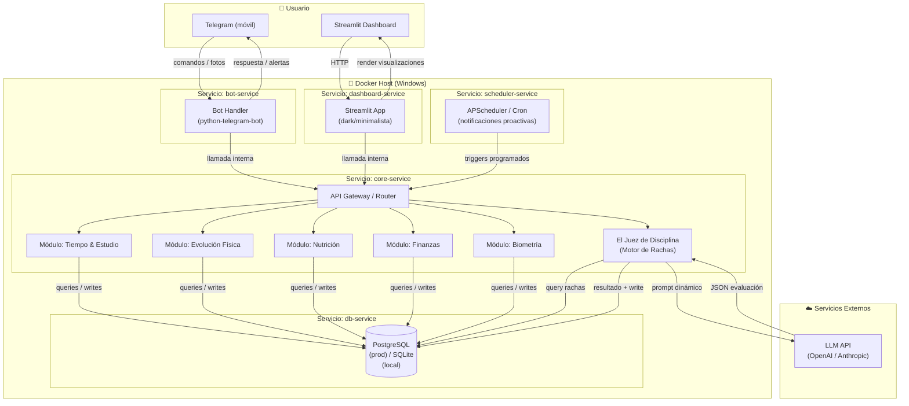
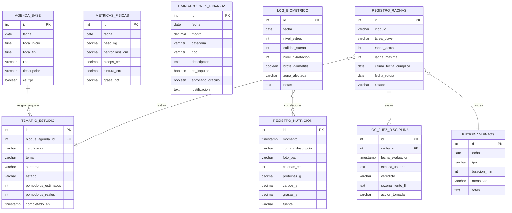

<div align="center">

# ⚡ JARVIS — Personal High-Performance OS

> ⚠️ **Project status:** Architecture/prototype scaffold. The README describes the intended system design; several modules are still being implemented and the repository should not be interpreted as a completed production system.


**Un ecosistema proactivo y contenerizado de gestión de vida, impulsado por agentes de inteligencia artificial y memoria relacional a largo plazo.**

[](https://www.python.org/)
[](https://www.docker.com/)
[](https://www.postgresql.org/)
[](https://streamlit.io/)
[](https://openai.com/)
[](LICENSE)
[]()

</div>

---

## 📌 Índice

- [Propuesta de Valor](#-propuesta-de-valor)
- [Arquitectura del Sistema](#-arquitectura-del-sistema)
- [Modelo de Datos (ERD)](#-modelo-de-datos-erd)
- [Stack Tecnológico](#-stack-tecnológico)
- [Estructura del Repositorio](#-estructura-del-repositorio)
- [Despliegue Local](#-despliegue-local)
- [Variables de Entorno](#-variables-de-entorno)
- [Flujo de Trabajo Git](#-flujo-de-trabajo-git)
- [Módulos del Sistema](#-módulos-del-sistema)
- [Roadmap](#-roadmap)

---

## 💡 Propuesta de Valor

Los LLMs tradicionales adolecen de un problema estructural crítico: **amnesia de contexto**. Cada sesión comienza desde cero. Sin historial. Sin continuidad. Sin evolución.

**Jarvis resuelve esto de raíz.**

En lugar de depender de la memoria efímera de un modelo de lenguaje, el sistema construye una **memoria relacional persistente** — una base de datos normalizada que captura cada racha de disciplina, cada métrica biométrica, cada decisión financiera y cada bloque de estudio completado.

El LLM no *es* el sistema. El LLM es el **motor de razonamiento** que el sistema invoca con contexto estructurado y preciso cuando necesita tomar una decisión. La inteligencia no vive en el modelo — vive en los datos.

### ¿Qué lo hace diferente?

| Característica | Chatbot Tradicional | Jarvis OS |
|---|---|---|
| **Memoria** | Efímera (por sesión) | Relacional persistente (PostgreSQL) |
| **Modo** | Reactivo (espera input) | Proactivo (scheduler automático) |
| **Contexto** | Conversación actual | Histórico completo del usuario |
| **Interfaces** | Una sola | Telegram (móvil) + Streamlit (desktop) |
| **Disciplina** | Sin seguimiento | Motor de Rachas + Juez con LLM |
| **Despliegue** | Script local | Microservicios contenerizados |

---

## 🏗 Arquitectura del Sistema



### Flujo de Datos Clave — El Juez de Disciplina

```
Usuario declara incumplimiento
        │
        ▼
C7 consulta racha activa en DB ──► contexto: días, máximo histórico, módulo
        │
        ▼
C7 construye prompt dinámico ──► inyecta contexto + excusa del usuario
        │
        ▼
LLM API ──► devuelve JSON { veredicto, razonamiento, accion }
        │
        ▼
C7 escribe LOG_JUEZ_DISCIPLINA + actualiza REGISTRO_RACHAS
        │
        ▼
Bot notifica al usuario con el veredicto
```

---

## 🗃 Modelo de Datos (ERD)



---

## 🛠 Stack Tecnológico

| Capa | Tecnología | Rol |
|---|---|---|
| **Runtime** | Python 3.11 | Lenguaje principal del sistema |
| **ORM** | SQLAlchemy 2.x | Abstracción y gestión de modelos de datos |
| **Base de Datos** | PostgreSQL 16 / SQLite | Persistencia relacional (prod / local) |
| **Contenerización** | Docker + Docker Compose | Orquestación de microservicios |
| **Interface Móvil** | python-telegram-bot | Canal de comandos y notificaciones proactivas |
| **Interface Desktop** | Streamlit | Dashboard de visualización y análisis |
| **Motor IA** | OpenAI GPT-4 / Gemini | Razonamiento contextualizado y evaluación |
| **Scheduler** | APScheduler | Triggers programados y notificaciones automáticas |
| **Migrations** | Alembic | Control de versiones del esquema de base de datos |

---

## 📁 Estructura del Repositorio

```plaintext
jarvis-os/
├── api/                  # Lógica de conexión con la IA y Prompts dinámicos
│   ├── __init__.py
│   ├── llm_client.py     # Cliente unificado OpenAI / Gemini
│   └── prompts/          # Templates de prompts por módulo
│
├── core/                 # Lógica de negocio central
│   ├── __init__.py
│   ├── time_engine.py    # Cálculos de tiempo y bloques de estudio
│   ├── streak_engine.py  # Motor de Rachas y validación
│   ├── judge.py          # El Juez de Disciplina (orquestador LLM)
│   ├── finance.py        # Módulo: Oráculo Financiero
│   ├── fitness.py        # Módulo: Evolución Física
│   ├── nutrition.py      # Módulo: Nutrición
│   └── biometrics.py     # Módulo: Biometría y correlaciones
│
├── database/             # Capa de persistencia
│   ├── __init__.py
│   ├── models.py         # Modelos SQLAlchemy (única fuente de verdad)
│   ├── session.py        # Gestión de sesiones y conexión
│   └── migrations/       # Scripts Alembic
│
├── frontend/             # Interfaces de usuario
│   ├── bot/
│   │   ├── __init__.py
│   │   ├── handlers.py   # Manejadores de comandos Telegram
│   │   └── keyboards.py  # Teclados inline y reply
│   └── dashboard/
│       ├── __init__.py
│       ├── app.py        # Entrypoint Streamlit
│       └── pages/        # Páginas del dashboard por módulo
│
├── docs/                 # Documentación técnica extendida
│   ├── architecture.md
│   ├── api_reference.md
│   └── diagrams/
│
├── .env.example          # Template de variables de entorno
├── .gitignore            # Exclusión de entornos virtuales y credenciales
├── docker-compose.yml    # Orquestación de microservicios locales
├── Dockerfile            # Receta de construcción del entorno de ejecución
└── requirements.txt      # Dependencias del sistema
```

---

## 🚀 Despliegue Local

### Prerrequisitos

- [Docker Desktop](https://www.docker.com/products/docker-desktop/) `>= 24.x` con WSL2 habilitado
- [Git](https://git-scm.com/) `>= 2.40`
- Claves de API: OpenAI o Gemini

### 1 — Clonar el repositorio

```bash
git clone https://github.com/tu-usuario/jarvis-os.git
cd jarvis-os
```

### 2 — Configurar variables de entorno

```bash
# Copiar el template de ejemplo
cp .env.example .env
```

Editar `.env` con tus valores reales:

```env
# ─── Base de Datos ───────────────────────────────────────────────
POSTGRES_USER=jarvis_user
POSTGRES_PASSWORD=supersecretpassword
POSTGRES_DB=jarvis_db
POSTGRES_HOST=db-service
POSTGRES_PORT=5432

# ─── Telegram Bot ────────────────────────────────────────────────
TELEGRAM_BOT_TOKEN=your_telegram_bot_token_here
TELEGRAM_ALLOWED_USER_ID=your_telegram_user_id

# ─── LLM APIs ────────────────────────────────────────────────────
OPENAI_API_KEY=sk-proj-xxxxxxxxxxxxxxxxxxxxxxxxxxxxxxxx
GEMINI_API_KEY=AIzaSyxxxxxxxxxxxxxxxxxxxxxxxxxxxxxxxx
LLM_PROVIDER=openai          # openai | gemini

# ─── Entorno ─────────────────────────────────────────────────────
ENVIRONMENT=development      # development | production
LOG_LEVEL=INFO
```

### 3 — Levantar el ecosistema completo

```bash
docker-compose up -d --build
```

Este comando único construye las imágenes y levanta los siguientes servicios:

| Servicio | Puerto | Descripción |
|---|---|---|
| `db-service` | `5432` | PostgreSQL — base de datos principal |
| `core-service` | `8000` | API Gateway y lógica de negocio |
| `bot-service` | — | Telegram Bot (long polling) |
| `dashboard-service` | `8501` | Streamlit Dashboard |
| `scheduler-service` | — | APScheduler / notificaciones proactivas |

### 4 — Verificar el estado de los servicios

```bash
# Ver logs en tiempo real de todos los servicios
docker-compose logs -f

# Ver estado de contenedores
docker-compose ps

# Conectarse a la base de datos
docker-compose exec db-service psql -U jarvis_user -d jarvis_db
```

### 5 — Acceder a las interfaces

```
Dashboard Streamlit  →  http://localhost:8501
Core API (health)    →  http://localhost:8000/health
Telegram Bot         →  Abrir Telegram y buscar tu bot
```

### Detener el entorno

```bash
# Detener sin eliminar volúmenes (datos persistidos)
docker-compose down

# Detener y eliminar volúmenes (reset completo)
docker-compose down -v
```

---

## 🔐 Variables de Entorno

> **Nunca** commitear el archivo `.env` real. El archivo `.env.example` es la única referencia versionada.

El archivo `.gitignore` excluye por defecto:

```gitignore
# Credenciales
.env
*.pem
*.key

# Entornos virtuales
venv/
.venv/
env/

# Python cache
__pycache__/
*.pyc
*.pyo
*.egg-info/

# IDE
.vscode/
.idea/
*.DS_Store

# Docker override local
docker-compose.override.yml
```

---

## 🌿 Flujo de Trabajo Git

Este proyecto sigue una variante simplificada de **GitFlow** con estándar de commits [Conventional Commits](https://www.conventionalcommits.org/).

### Estructura de Ramas

```
main          ← Producción estable. Solo recibe merges desde develop.
│
└── develop   ← Rama de integración. Base de trabajo activo.
    │
    ├── feature/nombre-modulo   ← Nuevas funcionalidades
    ├── fix/nombre-bug          ← Corrección de errores
    ├── refactor/nombre-area    ← Refactorizaciones sin cambio funcional
    └── docs/nombre-seccion     ← Actualizaciones de documentación
```

### Abrir una rama de trabajo

```bash
# Siempre partir desde develop actualizado
git checkout develop
git pull origin develop

# Crear rama de feature
git checkout -b feature/juez-disciplina

# Crear rama de fix
git checkout -b fix/streak-calculation-off-by-one
```

### Estándar de Commits (Conventional Commits)

```
<tipo>(<alcance opcional>): <descripción imperativa en minúsculas>
```

| Tipo | Cuándo usarlo |
|---|---|
| `feat` | Nueva funcionalidad o módulo |
| `fix` | Corrección de bug |
| `docs` | Cambios en documentación únicamente |
| `chore` | Tareas de mantenimiento, deps, CI/CD |
| `refactor` | Refactorización sin cambio de comportamiento |
| `test` | Adición o modificación de tests |
| `perf` | Mejora de rendimiento |

**Ejemplos correctos:**

```bash
git commit -m "feat(judge): implement LLM-powered discipline evaluation engine"
git commit -m "feat(bot): add /registro_entrenamiento command with inline keyboard"
git commit -m "fix(streak): correct off-by-one error in consecutive day calculation"
git commit -m "refactor(database): migrate session management to context managers"
git commit -m "docs(readme): add system architecture mermaid diagram"
git commit -m "chore(docker): pin postgresql image to version 16.2-alpine"
```

**Ejemplos incorrectos:**

```bash
git commit -m "fix stuff"           # ❌ Demasiado vago
git commit -m "WIP"                 # ❌ No descriptivo
git commit -m "Added new feature"   # ❌ No sigue el estándar
git commit -m "FEAT: Something"     # ❌ Tipo en mayúsculas
```

### Integrar trabajo a develop

```bash
# Desde tu rama de feature, con develop actualizado
git fetch origin
git rebase origin/develop

# Push y abrir Pull Request
git push origin feature/juez-disciplina
```

> **Regla:** No se hace push directo a `main` ni a `develop`. Todo cambio pasa por Pull Request con al menos una revisión de código.

---

## 🧩 Módulos del Sistema

### 🕐 Tiempo & Estudio
Gestión de bloques de agenda con técnica Pomodoro integrada. Calcula tiempo disponible real, asigna sesiones de estudio a certificaciones activas y registra el progreso real vs. estimado.

### 💪 Evolución Física
Registro de sesiones de entrenamiento con tipología e intensidad. Tracking de métricas corporales (peso, composición, medidas) con visualización de tendencias históricas.

### 🥗 Nutrición
Logging de comidas con soporte de análisis por foto vía LLM Vision. Estimación automática de macronutrientes (proteínas, carbos, grasas) y calorías totales diarias.

### 💰 Finanzas — El Oráculo
Sistema de validación de transacciones con categorización inteligente. El Oráculo evalúa compras por impulso usando contexto financiero histórico antes de aprobarlas.

### 🫀 Biometría
Registro diario de métricas de salud subjetivas: nivel de estrés, calidad del sueño, hidratación y seguimiento de condiciones cutáneas. Genera correlaciones con registros de nutrición.

### ⚡ El Juez de Disciplina
Motor central de accountability. Mantiene rachas activas por módulo y tarea clave. Cuando el usuario reporta incumplimiento, el Juez consulta el historial completo, construye un prompt con contexto real y delega el veredicto al LLM. La respuesta JSON incluye razonamiento explícito y acción tomada. **Sin excusas sin evidencia.**

---

## 🗺 Roadmap

- [x] Arquitectura base de microservicios con Docker Compose
- [x] Modelos de base de datos y migraciones con Alembic
- [ ] `feat(bot)` — Implementación completa de handlers Telegram
- [ ] `feat(judge)` — Motor de Rachas y Juez de Disciplina
- [ ] `feat(dashboard)` — Dashboard Streamlit con modo oscuro
- [ ] `feat(nutrition)` — Análisis de comidas por foto (LLM Vision)
- [ ] `feat(finance)` — Oráculo de aprobación de compras
- [ ] `feat(scheduler)` — Notificaciones proactivas programadas
- [ ] `feat(biometrics)` — Correlaciones biométricas automatizadas
- [ ] `chore(ci)` — Pipeline de CI con GitHub Actions
- [ ] `feat(auth)` — Autenticación multi-usuario

---

<div align="center">

**Construido con disciplina. Diseñado para escalar.**

*"La inteligencia no vive en el modelo. Vive en los datos."*

</div>
